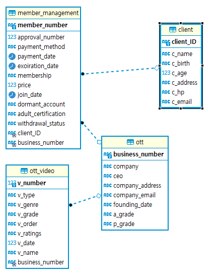
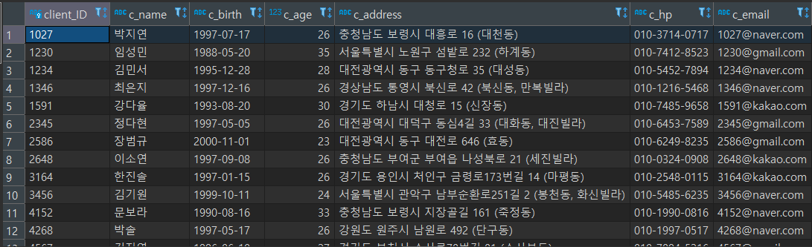
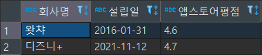
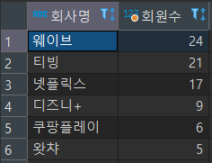
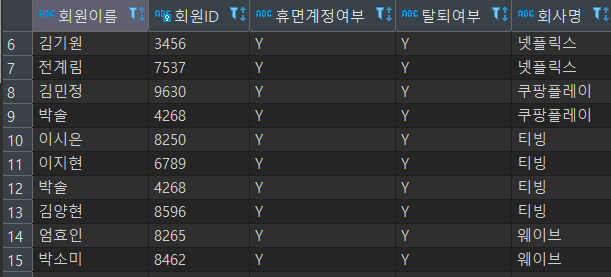
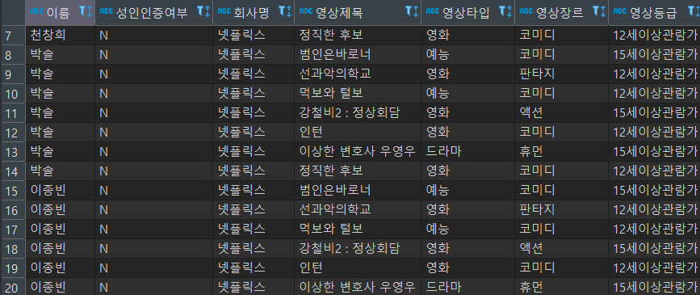
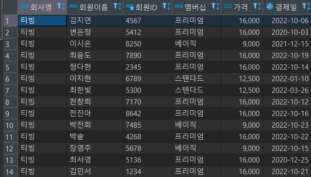
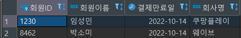

# OTT_Modeling_Project

- 주제선정 이유

  > 회원이 멤버십 결제를 하고 OTT 플랫폼을 이용하는 시스템을 알아보았습니다.

- 모델링

  > 1.DB ERD Modeling<br> 2.엔티티 관계도<br>

- 쿼리
  > 고객테이블 전체조회

```sql
select * from client
```


<br>
<br>

> 앱스토어 평점이 4점 이상인 회사명, 설립일, 앱스토어평점 조회

```sql
select company as "회사명", founding_date as "설립일", a_grade as "앱스토어평점" from ott where a_grade >= 4
```


<br>
<br>

> OTT별 회원수가 많은 순서대로 회사명 조회

```sql
SELECT t.company AS "회사명",count(*) AS "회원수"
FROM member_management AS m INNER JOIN ott AS t ON m.business_number = t.business_number
GROUP BY t.business_number ORDER BY count(*) desc
```


<br>
<br>

> 휴먼계정이고 탈퇴한 고객의 ID와, 탈퇴한 회사명 조회

```sql
select c.c_name as '회원이름', c.client_ID as '회원ID', mm.dormant_account as '휴면계정여부',mm.withdrawal_status as '탈퇴여부',o.company as '회사명'
from client as c inner join member_management as mm on c.client_ID = mm.client_ID
inner join ott as o on o.business_number = mm.business_number
where mm.dormant_account = 'Y' and mm.withdrawal_status = 'Y'
```


<br>
<br>

> 넷플릭스에서 성인인증을 하지 않은 회원이 볼수 있는 영상의 제목과 영상등급, 성인인증여부, 회원이름 조회

```sql
select c.c_name as '이름',mm.adult_certification as '성인인증여부',o.company as '회사명', ov.v_name as '영상제목', ov.v_type '영상타입',ov.v_genre as '영상장르',ov.v_ratings as '영상등급'
from ott_video as ov inner join ott as o on ov.business_number = o.business_number
inner join member_management as mm on mm.business_number = o.business_number
inner join client as c on mm.client_ID = c.client_ID
where o.company ='넷플릭스' and mm.adult_certification ='N' and ov.v_ratings != '청소년관람불가'
```


<br>
<br>

> 티빙을 이용하는 고객들의 이름,ID,멤버십,결제일,가격 조회

```sql
select o.company as '회사명',c.c_name as '회원이름',c.client_ID as '회원ID', mm.membership as '멤버십', mm.price as '가격', mm.payment_date as '결제일'
from ott as o inner join member_management as mm on o.business_number = mm.business_number inner join client as c on c.client_ID = mm.client_ID
where o.company ='티빙'
```


<br>
<br>

> 결제만료일이 10월달인 회원의 이름과 아이디,결제만료일 조회

```sql
select c.client_ID as '회원ID',c.c_name as '회원이름',mm.exoiration_date as '결제만료일',o.company as '회사명'
from client as c inner join member_management as mm on c.client_ID = mm.client_ID inner join ott as o on o.business_number =mm.business_number  where date_format(mm.exoiration_date,'%m')='10'
```


