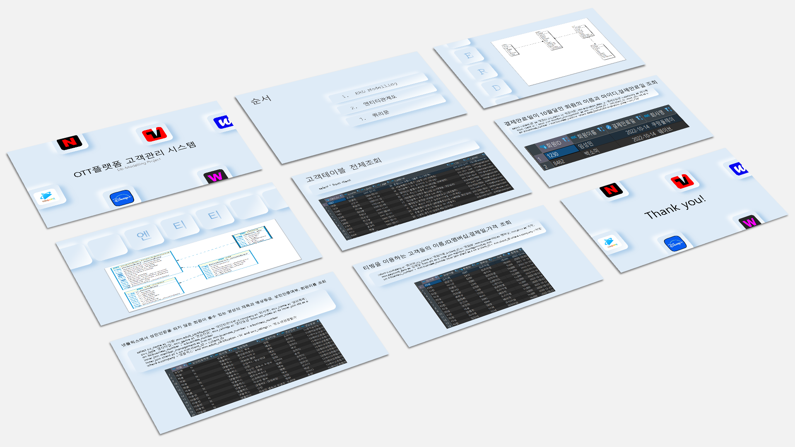

# DB Modeling Project

 

- 주제 : OTT 플랫폼 고객관리 프로젝트
- 개요 : OTT 플랫폼 고객관리 프로젝트는 고객이 OTT 플랫폼을 이용하는 시스템을 알아보기 위해 만든 프로젝트입니다.
- 프로젝트 기간 :1주(2022.10.17~2022.10.24)
- 사용기술 : MySQL, ERWin
 
 
### 💡프로젝트를 마무리하며

➰테이블에 컬럼이 많거나 컬럼 데이터에 null이 많으면 좋지 않은 테이블이다.

➰ 관계형 DB의 이해도와 관계 구도를 생각하여 PK, FK, UK의 사용이유와 관계형 DB의 특징을 이해하는데 있어서 많은 도움이 되었습니다.

➰MYSQL 배울 때까지만 해도 쉬운 거 같았는데 모델링을 직접 해보면서 쉽지 않다는 것을 깨달았고 더 공부해보는 계기가 되었다.