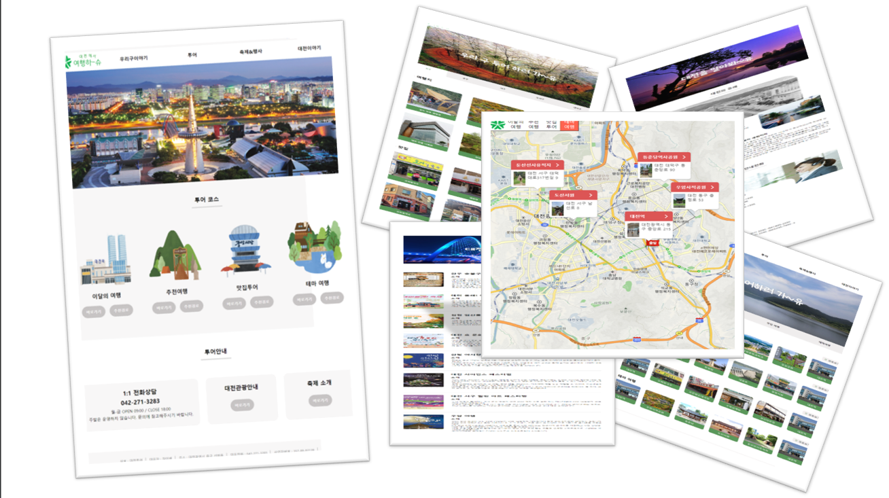

# Daejeon Travel-Hasyu

- 주제 : 대전에서 여행하~슈
- 개요 : 대전에서 여행하~슈는 대전의 맛집과 여행장소를 추천해주고 대전을 홍보하기 위해 만든 프로젝트 입니다.
- 프로젝트기간 : 2주(2022.10.31~2022.11.10)
- 사용기술 : HTML, CSS, JavaScript, Git
- 프로젝트인원 : 3명(프론트 3)
- 담당업무 : 페이지구성 및 페이지개발
- 세부업무 : 메인페이지, 축제홍보 페이지 개발
 
 
### 💡프로젝트를 마무리 하며
➰ 메인 페이지에 슬라이드 부분 이미지를 부드럽게 넘어갈 수 있도록 적용하지 못한 게 아쉬웠다.

➰ 축제 및 페스티벌 페이지에 클릭 시 상세 페이지로 넘어가게 했다면 하는 아쉬움이 남았다.

➰ 팀원들과 소통을 더 많이 자주 해야 한다는 느낌이 들었다.

➰ 프로젝트를 하면서 HTML과 CSS, Javascript에 대해 더 많은 공부를 하게 되는 계기가 되었다.

➰ 이미지 저작권 때문에 사이트 등록을 하지 못해서 많은 아쉬움이 있었다.