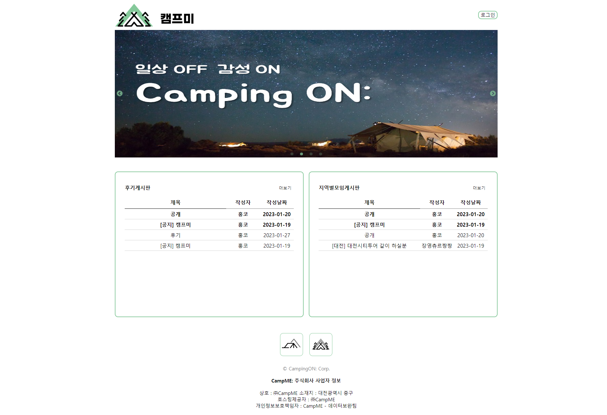

# CampMe

- 주제 : 캠핑장 정보공유 및 소통 커뮤니티 
- 개요 : 캠핑장에 관련된 정보를 공유하고 자유롭게 소통을 할 수있는 홈페이지를 만든 프로젝트 입니다.
- 프로젝트 기간 : 4주(2023.01.02~2023.01.27)
- 프로젝트 인원 : 3명(프론트 2, 백엔드 1)
- 사용 기술 : React.js, Spring Boot, JPA, MySQL, Git, AWS
- 담당 업무 : 
- 세부 업무 : 

- 느낀점 : 

- 보완점 :