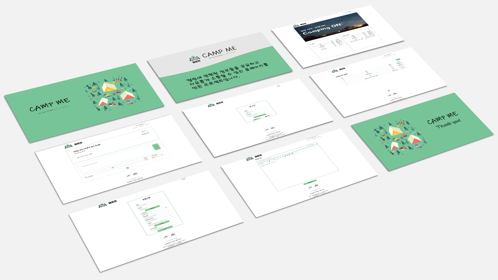

# CampMe

- 주제 : 캠핑장 정보공유 및 소통 커뮤니티 
- 개요 : 캠핑장에 관련된 정보를 공유하고 자유롭게 소통을 할 수있는 홈페이지를 만든 프로젝트 입니다.
- 프로젝트 기간 : 4주(2023.01.02~2023.01.27)
- 프로젝트 인원 : 3명(프론트 2, 백엔드 1)
- 사용 기술 : React.js, Spring Boot, JPA, MySQL, Git, AWS
 
 
### 💡프로젝트를 마무리 하며

➰ React를 팀원들과 공부하면서 한 프로젝트이기 때문에 프로젝트를 시작하기전에 더 배우고 시작했더라면 더 퀄리티가 높은 페이지가 나오지 않았을까 하는 생각이 들었다.

➰ 글 목록에 공지사항을 게시판별로 등록할 수 있도록 구현했어야 하는 아쉬움이 들었다.

➰ git으로 프로젝트를 관리하면서 개인프로젝트 때는 느끼지 못했던 commit 충돌이 있었고, 팀원들과 소통을 제대로 하지 못해서 생긴 이슈들로 소통이 중요하다는 것을 느끼는 계기가 되었다.

